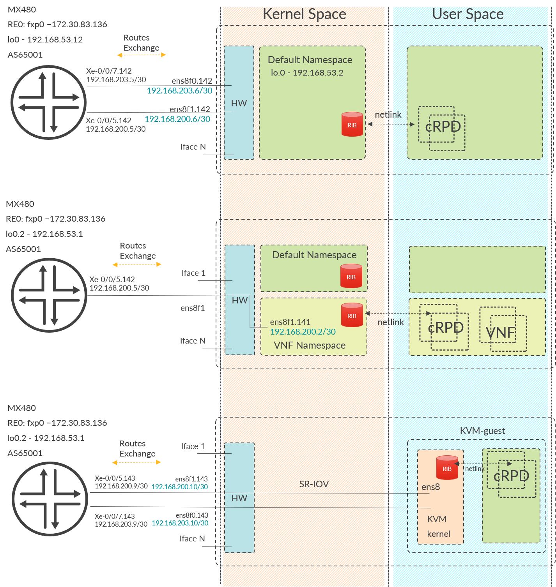

# Routing at the Host (RotH) with Juniper's cRPD
Code authors: Christian Graf(cgraf@juniper.net) and David de Andres(ddeandres@juniper.net)

## Disclaimer
This repository is a best-effort work. This means that it can contain mistakes in the documentation as well as bugs in the scripts provided. Therefore, please use it at your own risk.

# Table of contents
1. Introduction and Use case Overview
   - General use cases for cRPD
   - Why RotH
   - RoTH deployment options
   - Covered use cases
2. Scenarios Overview
3. Pre-requisites
   - Installing the license
4. Use case 1 - RotH - cRPD populates the hosts default RIB
   - config and setup
5. Use case 2 - cRPD providing routing-knowedge to another docker-container onl
   - Use case 2 - demo scenario
6. Use case 3 - cRPD on KVM and SR-IOV      
7. Use case 4 - build you own topology instructions   
8. Scripts and usage
9. Known issues
10. Useful comands and information

## Introduction

cRPD is Juniper routing protocol stack decoupled from JUNOS and packaged for Linux container environments.
+ Deployable on demand as a microservice
+ Lightweight: 3 seconds startup, ~ 350 MB image size, ~ starting from 100MB RAM
+ 200M RIB, 48K routes/sec FIB download
+ Can program Linux FIB: IPv4, IPv6, MPLS
+ NETCONF, OpenConfig, CLI
+ Automation, Telemetry,  Programmability
+ Supports Kubernetes, Docker swarm

### General use cases for cRPD
- cRPD can be deployed as BGP Route-Reflector/Route-Server
- cRPD might be used as Routing-Daemon on a Whitebox-switch or some custom hardware to built your own router
- cRPD might be used for the "Routing on the Host (RotH)" purpose. This is what is covered in this doc.

### Why RotH

When looking at the RotH usecase, the interested reader might ask for what good reason the cRPD might be beneficial?

First of all, when the Host acts as router, then there is no need to run VRRP, MC-LAG or Virtual-Chassis to provide link-redundancy towards the attached host. All VRRP, MC-lAG and Virtual-Chassis require a dependency between the involved switches/routers, which adds a burden for operations and increase e.g. troubleshooting-complexity with e.g. an insane state for MC-LAG (via ICCP-Protocol). In the worst case, then both switches running the MC-LAG might be affected, which somewhat nullifies the benefit of multihoming.
As an alternative option, plain routing on the host does not need any further syncing (e.g. arp-state syncing for MC-lag) between the switches, they just route.

Therefore, a solution would be to enable BGP-routing on the host via cRPD and VRRP, MC-LAG and Virtual-chassis could then be removed while the host would still have full redundant ECMP-capable uplinks.

Another aspect is effectively a reverse-perspective VRRP:
- to know if its various upstreams are alive.
- simply want a default-route, perhaps with load balancing.
- In some cases, have enough prefix data to provide for actual destination network failure detection

Simple BGP solves these problems quite nicely, especially if coupled with BFD. Providing more prefix-data can be solved by subscribing via policy to receive «important destination»" .

RoTH provides better ECMP-redundancy, while lowering complexity on the switches it is attached to.

### RoTH deployment options

- cRPD populating Hosts routing-table, where finally all VNF's can benefit from
- cRPD populating a specific docker-containers routing-table
- cRPD populating a KVM-guests routing-table
- while not covered in this doc, cRPD can be used to build a network-topology to develop new configurations, prepare for testing and even run scaling-tests [TO-DO]
- the usecases of cRPD deploying on whitebox-switches is not covered in this doc as well


### Covered use cases

The cRPD is agnostic to the linux namespace it is launched in. This enables different scenarios depending on the underlying host's configuration. This guide is covering these usecases:

1. When launched in the hosts default namespace, then cRPD populates the hosts routing-table, thus providing routing-knoweldge to the native TCP-/IP stack. As result any applications/hypervisors running on the host (and finally VNF's) can make use the routing-knoweldge shared by cRPD.

2. It might be desired, that routing-knowledge shall only made available to specific docker-containers. In such use case the cRPD can be launched in the same network-namespace as the target docker-container.

3. Finally, cRPD can be tight to a KVM-guest. In such case the KVM-guest must be able to launch itself docker-containers to start the cRPD.

Please note, that there is no hard-limit on the cRPD instances which can be launched on the Host.
However, only one cRPD instance shall run in the default namespace as it will manage the default ip stack and having more than one could cause unstable behavior of the host.
But as already mentioned, you can launch any number of cRPD instances isolated in different namespaces where other containers might or might not be present.

## Scenarios overview
The below diagram maps with the above mentioned use cases. The configuration parameters displayed are the ones which have been used on our tests so please treat them as examples.

## Pre-requisites
+ Ubuntu 18.04
+ see: https://www.juniper.net/documentation/en_US/crpd/topics/reference/general/crr-system-requirement-docker.html
+ Docker Engine. E.g. by following the instructions [https://docs.docker.com/engine/install/ubuntu/](Install Doker Engine on Ubuntu)
+ Juniper cRPD. Download and import cRPD from the Juniper support downloads page. Currently using version 19.4R1.10.
+ Juniper cRPD license key (required to run BGP here)

## Setting up general stuff
[To-Do] Explain loopback interface naming convention for the different platforms
### Loading the cRPD image
Once the crpd.tgz file has been downloaded from juniper.net, it must be loaded into docker. To do this:
```bash
docker load --input crpd.tgz
```
It can now be verified that it is present with:
```bash
docker image ls
```
### Creating docker volumes
Volumes are the preferred mechanism for persisting data generated by and used by Docker containers. Volumes are often a better choice than persisting data in a container’s writable layer, because a volume does not increase the size of the containers using it, and the volume’s contents exist outside the lifecycle of a given container. For more info, [https://docs.docker.com/storage/volumes/]().
To create a volume:
```bash
docker volume create <volume_name>
```
[TO-DO] pre-populating config-files


### Installing the license
If this is the first time you run cRPD in this testbed, you need to install the cRPD license key. There are several options, the easiest is to launch the cli via `docker exec -it crpd cli` and then copy-pasting the license code 'request system license add terminal'. Another option is to pre-provision it on the config volume that is provided when running the container. To find the mounting point run `docker volume ls` and then `docker volume inspect <vol_name>`, which will display the path where the volume files are. Last, copy the license file to the `./license` folder. We must now load it in the cRPD
```
docker exec -it crpd cli
#in case it has been copied into the volume
request system license add /config/license/<filename>
#in case you want to copy paste it
request system license add terminal
```

## Use case 1 - RotH - cRPD populates the hosts default RIB
The cRPD can be used to use the native TCP/Ip stack of the host and polulate the hosts routing-table via any protocol running on the cRPD.
Technically the cRPD runs into the default-namespace of the Host, hence in the document we name it the "Host-Mode".

In Host-Mode, any interface route from linux kernel gets distributed via netlink to the cRPD instance. There is no need to configure any addresses within cRPD-CLI (except family ISO [TO-DO] check MPLS). Any IPv4/IPv6 addressing is derived from the host's kernel. In other words, all the host's default namespace will be exposed to the cRPD but will not be configured by it.

### Use case 1 - config and setup (Quickstart)

To run cRPD in host mode:
``` bash
#create volumes
docker volume create <volume_for_config>
docker volume create <volume_for_varlog>
#run cRPD in host mode --net=host
docker run --rm --detach --name <name> -h <hostmode> --privileged --net=host -v <volume_for_config>:/config -v <volume_for_varlog>:/var/log -it crpd:19.4R1.10
```
To log into the cRPD cli:
```bash
docker exec -it <name> cli
```
Where \<name> is the name of the container where you would like to tun a command, cli is the command and -i stands for interactive and -t for tty.
To stop the cRPD:

```bash
docker stop <name>
```


## Use case 2 - cRPD providing routing-knowedge to another docker-container only


In this mode it is desired to provide any other docker-container a dedicated routing-daemon.
As such in this document we name this use case "non-default namespace mode"

For below solution is it important to have in mind that docker-containers make extensive use on the namespaces the linux-kernel is offering. With a name-space, kernel-resources are partitioned and kept hidden from each other. As result, a docker-container can either run in the default network-namespace, or it can also run in its "own" namespace. If now a routing-daemon shall be attached to a docker-container, then there is just **one important step**:
- The cRPD as routing-daemon must run in the same namespace as the target docker-container.

When launching cRPD, this is achieved by setting the `-net=container<containername>` as seen in below example. Finally, the operator need to decide which interfaces shall be exposed towards the given network-namespace.

One, possible solution are from dockers default-networking, virtual-ethernet-pairs (veth) or even physical interfaces like ens8f0 or subunits ens8f0.142. All of them are possible and covered in this guide.

This co-existence of cRPD and the target docker-container running in same namespace, allows the cRPD to manage the RIB and FIB belonging the namespace.

[To-Do] Here it is explained how to run it in the namespace of another container
To run cRPD in "non-default namespace mode"
```bash
# in this example, alpine (lightweight linux) is used as VNF
docker run --rm --detach --name alpine -h alpine --privileged --net=none -it alpine:latest
docker run --rm --detach --name crpd_alpine --privileged --net=container:alpine -v <volume_for_config>:/config -v <volume_for_varlog>:/var/log -it crpd:19.4R1.10
```
It is important to notice that in this mode, the VNF must be instantiated with *--net=none*

At this point, if we run `show interfaces routing` it won't display any interfaces because the namespace where it is running is empty. In the same way, if we log into the VNF and perform an `ip route` command, we won't see any routes.
```
root@alpine> show interfaces routing
Interface        State Addresses
lsi              Up    MPLS  enabled
                       ISO   enabled
                       INET6 fe80::5068:27ff:fec4:9267
lo.0             Up    MPLS  enabled
                       ISO   enabled

```

Different kind of interfaces can be attached to cRPD and therefore can be moved to the required namespace:
- A physical interface (ifd) like ens8f0
- A logical interface (ifl) like ens8f0.142
- A virtual ethernet device (veth)

### Virtual ethernet pairs (veth)
The veth devices are virtual Ethernet devices. They can act as tunnels between network namespaces to create a bridge to a physical network device in another namespace, but can also be used as standalone network devices.
Source and further information: [veth - Virtual Ethernet Device](http://man7.org/linux/man-pages/man4/veth.4.html)

So comming back to how to add any interface to the namespace:
```
ip link set <interface> netns <namespace>
```
Which will produce the below output if we run `show interfaces routing`:
```
lab@ubuntu-cg ~> docker exec -it crpd_alpine cli
root@alpine> show interfaces routing
Interface        State Addresses
lsi              Up    MPLS  enabled
                       ISO   enabled
                       INET6 fe80::5068:27ff:fec4:9267
vethi_53408      Up    MPLS  enabled
                       ISO   enabled
                       INET6 fe80::9cae:91ff:fefb:d5a1
lo.0             Up    MPLS  enabled
                       ISO   enabled
                       INET  192.168.53.14
```

### Usecase 2 - config and setup

As a more complete example, below, a bridge is created where a physical(logical) interface and a veth endpoint are connected. The other endpoint of the veth interface is moved to the VNF's namespace
```bash
#start the containers
docker run --rm --detach --name alpine -h alpine --privileged --net=none -it alpine:latest
docker run --rm --detach --name crpd_alpine --privileged --net=container:alpine -v crpd01_config:/config -v crpd01_varlog:/var/log -it crpd:19.4R1.10
```
Find the VNF's pid to manipulate the namespace and define variables
```bash

pid=$(docker inspect alpine --format '{{ .State.Pid }}')
interface=##provide interface name
veth_main=veth_${pid}
veth_instance=vethi_${pid}
renamed_interface_in_instance=  ## could be set to: =${interface}

```
Cofigure both default and namespace network
```bash
# bring interface up, enable promisc mode
ip link set $interface promisc on
ethtool -K $interface gro off
ip link set $interface up

# create veth pair i
echo ${veth_main}
echo ${veth_instance}
sudo ip link add ${veth_main}  type veth peer name ${veth_instance}  # create veth pair

# create bridge. move veth_main to this bridge
bridge=alpine
brctl addbr $bridge # create bridge with name of docker_instance
ip link set $bridge up  # enable the bridge
brctl addif $bridge ${veth_main} # move veth_main to bridge
brctl addif $bridge ${interface} # move physical interface to bridge
ip link set ${veth_main} up # bring interface up


# link the namespace
sudo mkdir -p /var/run/netns
sudo ln -sf /proc/$pid/ns/net /var/run/netns/$pid

# move the instance-leg to crpd namespace
ip link set ${veth_instance} netns $pid
# bring interface up
ip netns exec $pid ip link set ${veth_instance} up

# configure ip address
sudo ip netns exec $pid ip addr add $ipadr dev ${veth_instance}
```
### usecase 3 - cRPD on KVM and SR-IOV
This use case covers KVM-based Virtual Machines with full-blown OS and its own routing-stack. The strength of this use case resides on their possibility to make use of more performant interfaces such as SR-IOV enabled ones. It is important to remark that for this use case, the cRPD runs on HOST mode as KVM enables a full OS.

The interesting part of this use cases resides in having 2 interfaces as we can use them to demonstrate uplink redundancy (ECMP). Thanks to this, for example, it can be shown that a running ping will not undergo packet loss even if the used link turns down as all the traffic will be inmediately shifted to the other interface.

For more information about KVM please refer to the [official page](https://www.linux-kvm.org/page/Main_Page).

[To-Do] Describe the topology here used

To launch a KVM guest:
```bash
virt-install --connect qemu:///system --virt-type kvm --name $name --ram $memory  --vcpus=$core --os-type linux --os-variant ubuntu16.04 --disk path=$image,format=qcow2 --disk cidata.iso,device=cdrom --
import --network network=default –noautoconsole
```
[To-Do] explain steps for increasing diskpspace and cloudinit
To verify that the KVM guest is running we make use of the (virsh tool)[https://libvirt.org/manpages/virsh.html#description]:
```bash
$ virsh list
Id    Name                           State
----------------------------------------------------
2     ubuntu_server_guest            running
```
To prepare the interfaces on the host for SR-IOV with 8 VF, a (reboot non-persistent) option is to perform:
```bash
$ echo 8 | sudo tee -a  /sys/class/net/<interface1>/device/sriov_numvfs
$ echo 8 | sudo tee -a  /sys/class/net/<interface2>/device/sriov_numvfs
```
A possibility to make this persistent is to include it in the `.bashrc` or configure it on `GRUB`. **Note**: to modify the number of VF an interim step to 0 is required.
To verify that SR-IOV is enabled:
```bash
$ ls -l /sys/class/net/<interface1>/device/virtfn* | grep fn7
lrwxrwxrwx 1 root root 0 Apr 23 12:14 /sys/class/net/ens8f0/device/virtfn7 -> ../0000:85:11.6
$ ls -l /sys/class/net/<interface2>/device/virtfn* | grep fn7
lrwxrwxrwx 1 root root 0 Apr 23 12:14 /sys/class/net/ens8f0/device/virtfn7 -> ../0000:85:11.7
```
The above `../0000:85:11.6` is really important and will be used in the next step to add the VF towards the guest. To do this, a convinient virsh xml file is created:

```
<!-------interface1----->
<interface type='hostdev' managed='yes'>
   <mac address="02:06:0A:81:11:6" />
   <source>
     <address domain="0x0000"  bus="0x85" slot="0x11" function="0x6" type="pci" />
   </source>
 </interface>

<!-------interface2----->
<interface type='hostdev' managed='yes'>
   <mac address="02:06:0A:81:11:7" />
   <source>
     <address domain="0x0000"  bus="0x85" slot="0x11" function="0x7" type="pci" />
   </source>
 </interface
```

[TO-DO] check if  `<target dev='ens9'/>` sets the name on the host

We can observe that the different parts of the output correspond to the domain, bus, slot and function which will enable virsh to connect it to the guest. Each interface is also provided with a unique MAC address. So at this point, the guest has an interface which must be configured:

```bash
sudo ifconfig <interface1> up
sudo ifconfig <interface2> up
sudo ip link add link <interface1> name <interface1>.<logical_unit> type vlan id <logical_unit>
sudo ip link add link <interface2> name <interface2>.<logical_unit> type vlan id <logical_unit>
sudo ip link set dev <interface1>.<logical_unit> up
sudo ip link set dev <interface2>.<logical_unit> up
sudo ip addr add 192.168.203.10/30 dev <interface1>.<logical_unit>
sudo ip addr add 192.168.200.10/30 dev <interface2>.<logical_unit>
sudo ip addr add 192.168.53.3 dev lo # for this demo a lo address is required
```

At this point, if we launch the cRPD container on HOST mode (as explained in the above section), all the interfaces should be known to him:
```
root@crpd01> show interfaces routing
Interface        State Addresses
...
lo.0             Up    MPLS  enabled
                       ISO   enabled
                       INET  192.168.53.3
ens9.143         Up    MPLS  enabled                <-- <interface1>.<logical_unit>
                       ISO   enabled
                       INET  192.168.203.10
                       INET6 fe80::6:aff:fe81:1106
ens9             Up    MPLS  enabled                <-- <interface1>
                       ISO   enabled
                       INET6 fe80::6:aff:fe81:1106
ens10            Up    MPLS  enabled                <-- <interface2>
                       ISO   enabled
                       INET  192.168.122.156
                       INET6 fe80::5054:ff:fec4:901c
ens10.143        Up    MPLS  enabled                <-- <interface2>.<logical_unit>
                       ISO   enabled
                       INET  192.168.200.10
                       INET6 fe80::6:aff:fe81:1107
```
In the same way, if we run `ip a` on the host we can see:
```bash
ubuntu@kvm_guest_bionic:~$ ip a
1: lo: <LOOPBACK,UP,LOWER_UP> mtu 65536 qdisc noqueue state UNKNOWN group default qlen 1000
    link/loopback 00:00:00:00:00:00 brd 00:00:00:00:00:00
    inet 127.0.0.1/8 scope host lo
       valid_lft forever preferred_lft forever
    inet 192.168.53.3/32 scope global lo
       valid_lft forever preferred_lft forever
    inet6 ::1/128 scope host
       valid_lft forever preferred_lft forever
2: ens9: <BROADCAST,MULTICAST,UP,LOWER_UP> mtu 1500 qdisc mq state UP group default qlen 1000
    link/ether 02:06:0a:81:11:06 brd ff:ff:ff:ff:ff:ff
    inet6 fe80::6:aff:fe81:1106/64 scope link
       valid_lft forever preferred_lft forever
2: ens10: <BROADCAST,MULTICAST,UP,LOWER_UP> mtu 1500 qdisc mq state UP group default qlen 1000
    link/ether 02:06:0a:81:11:07 brd ff:ff:ff:ff:ff:ff
    inet6 fe80::6:aff:fe81:1107/64 scope link
       valid_lft forever preferred_lft forever
3: ens9.143@ens9: <BROADCAST,MULTICAST,UP,LOWER_UP> mtu 1500 qdisc noqueue state UP group default qlen 1000
    link/ether 02:06:0a:81:11:06 brd ff:ff:ff:ff:ff:ff
    inet 192.168.203.10/30 scope global ens9.143
       valid_lft forever preferred_lft forever
    inet6 fe80::6:aff:fe81:1106/64 scope link
       valid_lft forever preferred_lft forever
4: ens10.143@ens10: <BROADCAST,MULTICAST,UP,LOWER_UP> mtu 1500 qdisc noqueue state UP group default qlen 1000
    link/ether 02:06:0a:81:11:07 brd ff:ff:ff:ff:ff:ff
    inet 192.168.200.10/30 scope global ens10.143
       valid_lft forever preferred_lft forever
    inet6 fe80::6:aff:fe81:1107/64 scope link
       valid_lft forever preferred_lft forever
```
To configure the cRPD for ECMP:
```
## Last changed: 2020-04-23 13:50:06 UTC
version 20191212.201431_builder.r1074901;
policy-options {
    policy-statement export-all {
        then accept;
    }
    policy-statement plb {
        then {
            load-balance per-packet;
        }
    }
}
routing-options {
    forwarding-table {
        export plb;
    }
    autonomous-system 65000;
}
protocols {
    bgp {
        group MX480 {
           family inet {
                unicast;
            }
            export export-all;
            peer-as 65001;
            multipath;
            bfd-liveness-detection {
                minimum-interval 300;
                multiplier 3;
            }
            neighbor 192.168.203.9;
            neighbor 192.168.200.9;
        }
    }
}
```


### Use case 4 - build you own topology instructions
[To-Do]

idea - just launching cRPD conatiners.
bind them via bridges together (vethi)
give clear insteructions


### creation of a demo-topology
[TO-DO] - idea is scaled scripting. low priority now. but overall important

## Scripts and usage
Scripts for initialization of VNF's with attached cRPD have been created. In addition, cleanup scripts for removing the configuration are also provided
### run_vnf_and_crpd.sh
This scripts instantiates a vnf with an attached crpd connected to a physical interface though a bridge
```
useage: run_vnf_and_crpd.sh -i <interface_name> --vnf <vnf_name:tag> -c <crpd:tag> -a <ipadr> [OPTIONAL] -v (override volumes, minimum provide 2) <volume_name>:<mounting_point>
```
### destroy_vnf_and_crpd.sh
This scripts instantiates a vnf with an attached crpd connected to a physical interface though a bridge
```
useage: destroy_vnf_and_crpd.sh -i <interface_name> --vnf <vnf_name> [OPTIONAL] -v (delete volumes)>
```

### create_crpd_veths.sh
This script creates the networking configuration for  vnf and crpd containers already instantiated.
```
useage: create_crpd_veths.sh <docker_instance> <interface> <ip>
```

## Known Issues
### IFL is not detected by cRPD in non-default namespace mode
When a logical interface was moved into the networking namespace where a cRPD instance was present, the cRPD was not able to pick up this interface and display it in its cli.
Juniper Engineering provided a container with the fix which has been tested in the following way.
  1. Launch the cRPD with the fix with the `--net=none` option
  ```bash
  docker run --rm --detach --name crpd01 --privileged --net=none -v crpd01_config:/config -v crpd01_varlog:/var/log -it crpd:latest
  ```
  2. Create a logical interface from a physical interface and move it to the cRPD's namepsace
  ```bash
  pid=$(docker inspect crpd01 --format '{{ .State.Pid }}')
  sudo ln -sf /proc/$pid/ns/net /var/run/netns/$pid
  sudo ip link add link ens8f0 name ens8f0.142 type vlan id 142
  sudo ip link set ens8f0.142 netns $pid
  sudo ip netns exec $pid ip link set ens8f0.142 up
  sudo ip netns exec $pid ip addr add 192.168.203.6/30 dev ens8f0.142

  ```
  3. Log into the cRPD
  ```bash
  docker exec -it crpd01 cli
  ```
  4. Now check the cRPD and verify that the interface is present
  ```
  root@crpd01> show interfaces routing
  Interface        State Addresses
  ens8f0.142       Up    MPLS  enabled
                         ISO   enabled
                         INET6 fe80::92e2:baff:fe86:6194
                         INET  192.168.203.6
  lsi              Up    MPLS  enabled
                         ISO   enabled
                         INET6 fe80::a86f:e2ff:fe4e:8dac
  lo.0             Up    MPLS  enabled
                         ISO   enabled  
  ```
### BFD reports an error


## Useful comands and information

```bash
#Junos Commands for cRPD
> show interface routing # displays the interfaces present in the cRPD’s namespace
> show bgp summary # presents a summary of the bgp neighbors' status
> show  route protocol bgp # presents the routes learned trough bgp peers

#Host commands
docker stats # presents the cpu and memory consumption statistics per container
docker volume list # lists the current existing docker volumes
docker volume inspect <volume_name> # provides information about the volume.
docker load --input crpd.tar #loads a crpd image into docker

#Network Namespace management commands
ip netns show # lists the existing namespaces
ip netns exec <namespace> ip addr # lists the interfaces and ip addresses of the provided namespace
ip netns exec <namespace> <command> # runs any command inside the provided namespace
ip link set <interface> netns <namespace> # moves the interface into the specified namespace
#VNF commands
ip address # shows the interfaces and ip addresses  available in the vnf’s namespace
ip routes # Shows the ip routes known to this vnf container

```
